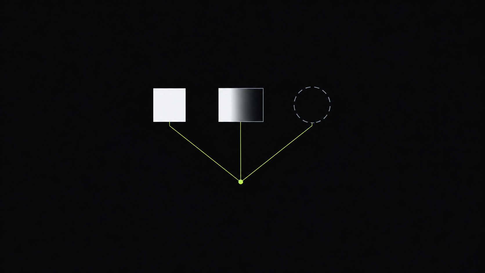

An options backtest can show a loss on a trade that finished exactly where you expected, and a gain on one that barely moved. That is not the report behaving oddly.

It usually means the premium was never only about the underlying's price to begin with. An option's premium moves for three separate reasons, and a report on an option strategy is really testing how a position responds to each of them. This post sets out the three forces — what the option is worth today, how much time remains, and how much movement the market expects — before looking at how they show up in a Taurus report.

## The problem

A position's premium is not a single quantity moving for a single reason. It is the sum of three, each on its own clock, and reading it as one number hides which of the three actually changed.

Intrinsic value is the part that would exist if the option were exercised right now: for a call, the amount by which the underlying's price sits above the strike; for a put, the amount by which it sits below. It moves only with the underlying, one-for-one, and it is zero whenever exercising early would not be worthwhile.

The two other components have nothing to do with where the underlying is standing. Time value is compensation for the chance that the underlying still has room to move in a favourable direction before expiration; an option can shed this value purely because fewer days remain, even while the underlying itself has not moved. And the market's estimate of how large a move could still happen — its expected movement — is a separate lever again: it tends to rise ahead of a known event and fall away once the event has passed, independent of which direction the underlying actually goes.

A backtest, or a live position, that only watches total premium mixes all three together. A trade can lose money purely to time decay while sitting exactly where it was opened. A trade can gain purely because expected movement rose into an earnings date, with the underlying unmoved. Attributing either move to a directional call being right or wrong is a mistake about which of the three forces actually did the work.

## The three forces, one at a time

**Intrinsic value.** This is the value the option would have if it were exercised immediately.

$$
\text{Intrinsic value (call)} = \max(S - K, 0)
$$

$$
\text{Intrinsic value (put)} = \max(K - S, 0)
$$

where $S$ is the underlying's current price and $K$ is the strike. A call only carries intrinsic value once the underlying trades above the strike; a put only once it trades below. The wider that gap, the larger the intrinsic component, and outside of it, intrinsic value is exactly zero — there is nothing to fall back on if the rest of the premium disappears.

**Time value.** Everything in the premium that is not intrinsic value is compensation for the days still left on the contract. More time means more opportunity for the underlying to move into a favourable range before expiration, so, all else equal, a longer-dated option carries more time value than a shorter-dated one struck at the same level. That value erodes as expiration approaches — an option can lose value with the underlying's price unchanged, purely because fewer days remain for anything to happen. The decay is not linear; it accelerates in the final stretch before expiration, because the same number of calendar days removes a much larger share of the opportunity that is left.

**Expected movement.** The third force is the market's own estimate of how far the underlying could still travel before expiration, independent of direction. When a large move looks plausible — commonly ahead of earnings, elections or interest-rate decisions — the option carries a premium for that possibility, because there is a wider band of outcomes in which it could finish in the money. Once the event passes and the range of likely outcomes narrows, that component tends to fall away, even if the underlying itself barely moved. This is the one force that has nothing to do with the underlying's current level or the calendar; it moves with how much uncertainty the market is carrying.

## What this means for a premium you're watching

Laid out side by side, two of the three forces do not care where the underlying is trading:

| Force | Depends on | Behaviour into expiration | Tied to the underlying's direction? |
|---|---|---|---|
| Intrinsic value | Underlying price vs. strike | Fixed relationship, resolved fully at expiration | Yes |
| Time value | Days remaining | Decays, faster as expiration approaches | No |
| Expected movement | The market's uncertainty about future moves | Builds into events, falls away once they resolve | No |

Two things worth noticing. First, only intrinsic value is deterministic — it is exactly the gap between spot and strike, nothing more and nothing less. The other two are estimates the market is making about the future, and estimates change even when nothing about the underlying itself has. Second, time value and expected movement can move against each other: an approaching event can add expected-movement premium at the same time that the calendar is quietly removing time value, so the two effects partly offset right up until the event, then reverse once it has passed. A premium that looks flat over that stretch can be masking two forces cancelling out, not two forces doing nothing.

## What this decomposition does not tell you

Naming the three forces does not quantify them. Splitting an actual premium into its intrinsic, time and expected-movement components requires a model with real inputs — volatility, days to expiration, and, for anything beyond the simplest instruments, interest rates and dividends — and different models will attribute the same premium slightly differently at the margins.

Nor does it say whether the market's estimate of expected movement will turn out to be right. A rising premium ahead of an event reflects a wider range of outcomes the market considers plausible, not a forecast of which outcome will happen, and after the event, the premium can fall away regardless of whether the actual move was large or small.

It also leaves out anything that is not about the contract's theoretical value: the gap between the level you can buy at and the level you can sell at, the effect of early exercise on American-style contracts, and how thin a market can make the quoted premium diverge from any of the three forces above.

## How this shows up in a Taurus report

A report does not decompose a single option's premium into its three forces directly, but the regime analysis section is built on a related idea. It groups the trading history into three states of realised volatility, using k-means over a twenty-session window, and reports performance separately within each. For a rule that trades options, that split is a way of asking whether returns hold up across calm and volatile stretches, or whether the result depends on catching, or avoiding, periods when expected movement was elevated.

If you already have a report in front of you, the check is simple: look at whether performance in the highest-volatility regime looks structurally different from the other two. A strategy whose edge only shows up in one regime is more exposed to that third force than the headline numbers suggest.

## FAQ

### Why can an option lose value even if the underlying hasn't moved?

Because part of the premium is time value, and time value depends on the calendar, not the underlying's price. Every day that passes without a favourable move removes some of that value regardless of where the underlying sits, which is why an unchanged position can still show a lower premium the next morning.

### Does expected movement only rise before scheduled events like earnings?

Scheduled events are the clearest example because everyone can see them coming, but the same effect shows up around any period of unusual uncertainty — a pending court ruling, a rumoured deal, or a market-wide shock. What raises this component is the width of plausible outcomes the market is weighing, not the calendar entry itself.

### Is intrinsic value the same thing as the premium?

No. Intrinsic value is only the part of the premium that would be captured by exercising immediately. The rest — time value and the expected-movement component — sits on top of it, which is why two options with the same intrinsic value can trade at very different premiums if they have different amounts of time left or different levels of expected movement.

### Why does time value decay faster as expiration approaches?

Because the opportunity that time value is compensating for shrinks non-linearly. With months to go, losing a week barely changes how much room the underlying still has to move; with days to go, losing that same week removes most of what was left. The decay accelerates because the remaining opportunity is what is shrinking, not the passage of time itself.

### Do calls and puts respond to expected movement in the same way?

Yes. Expected movement is about the size of a potential move, not its direction, so a rise in that component adds premium to both calls and puts on the same underlying. What differs between a call and a put is how intrinsic value behaves — one gains as the underlying rises, the other as it falls — not how either one responds to a widening range of expected outcomes.
