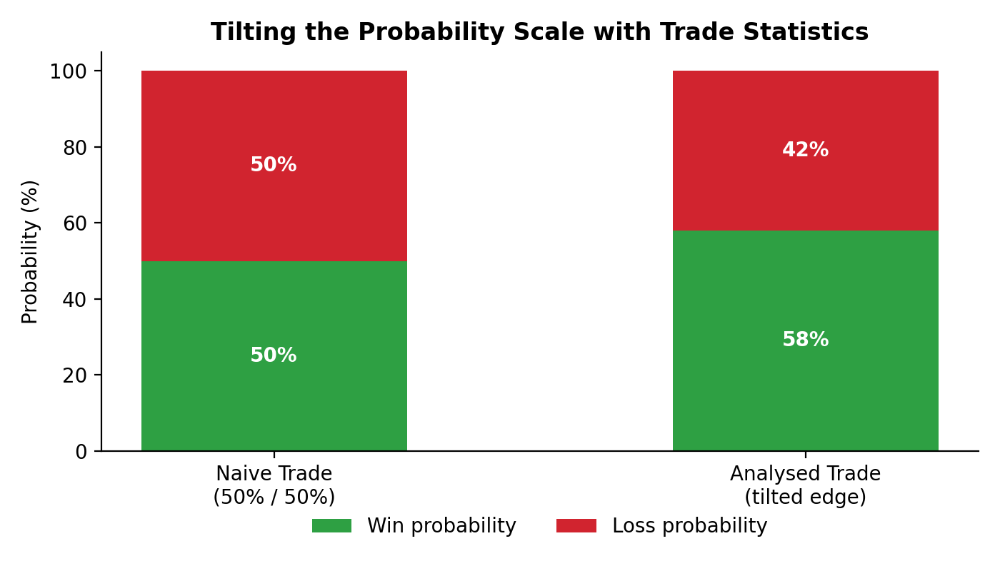
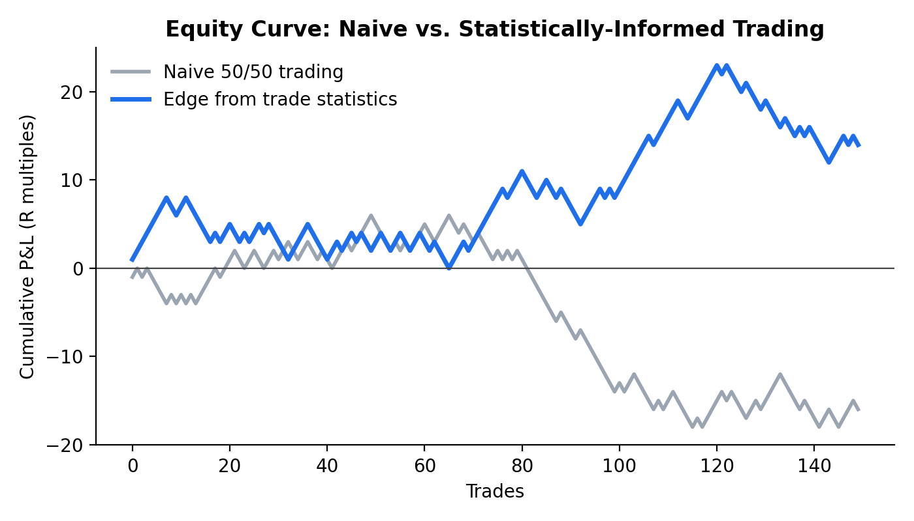

Trading is, mechanically, a zero-sum exchange: one side's gain is the other side's loss. Held in the mind, though, it is a test of patience, and the outcome of any single trade is unknowable in advance. A rule can look convincing every time you replay it and still be running on the same odds as a coin flip.

The gap between those two states, a fair coin and a genuine tilt, is not something a trader can feel from the inside. It has to be measured. A trade statistics report is what turns a hunch about an edge into a number, and this post is about what that number actually does for a trading rule, and where its measurement stops.

## The problem

Every trading rule carries a claim built into it, whether the person who wrote it says so or not: that its entries land on the right side of the market more often than chance would. That claim feels self-evident from the inside. You remember the trades that worked, you can explain why the logic makes sense, and the rule survives every mental replay you give it.

None of that is measurement. A rule that has never been run through its own trade history is, for capital allocation purposes, indistinguishable from a coin flip. The conviction behind it is not evidence that the coin is unfair. The two states, a fair coin and a genuine tilt, produce identical-looking short runs and only separate once enough trades have accumulated to see the difference.

The cost shows up in sizing, not in the win-loss tally itself. A trader who believes their rule already carries an edge sizes positions as if that edge is confirmed. A trader who knows their rule still needs testing sizes more conservatively until it is. Skip the report and you are making the first decision without knowing which trader you actually are.

A trade statistics report does not shorten the waiting that trading demands. It tells you, at any point along it, whether the wait is being spent on a real edge or a fair coin dressed up as one.

## How it works

A trade statistics report is a summary of a rule's own history, not a new signal. Every closed trade already carries a result, win or loss, in whatever unit the rule is measured in. Line those results up and the report asks one question: does the population of outcomes sit meaningfully away from an even split, or not.

### The probability tilt

A naive trade holds a 50/50 shot at going in your favour and no more, because a coin flip does not remember what an entry rule reasoned about the market beforehand. Run a rule's own trade history through a report and that fair-coin assumption gets replaced with a measured number.

The shift in that chart, eight points off an even split, looks small next to the drama most traders expect from an edge. It is not small once it repeats. The same eight-point tilt, held over the same number of trades, is the entire distance between an equity curve that drifts and one that compounds.

Neither curve above is a forecast. They are the same 150 draws played out twice, once at an even split and once with the tilt shown above, to show what a persistent edge does once compounding gets a turn at it. A real trade history is noisier than either line, but the shape of the gap between them is the reason the tilt is worth measuring in the first place.

### Instrument, timeframe and regime

A win rate is the headline number, but a report earns its keep on the questions behind it. Which instrument the tilt shows up in. Which timeframe it survives on, intraday, swing or longer. Which session or time zone it concentrates in, since a rule that only wins in one window of the day is a different rule from one that wins everywhere. Which market regime, trending, ranging, high or low volatility, the tilt depends on, because a rule that only holds in one regime is not the same as a rule that holds in all of them.

None of this is available from the rule itself. A rule is a set of conditions, written down once, carrying the same conviction whether the market it was written for is still there or not. A report is what tests that conviction against the rule's actual trade history, instrument by instrument and regime by regime.

## What it means for a report

A win rate on its own is not the edge. It is one output of it. A report has to separate the raw tally of wins and losses from the distribution those wins and losses come in, because two rules can share a win rate and carry very different risk. A rule that wins 58% of the time with small, even outcomes is not the same rule as one that wins 58% of the time with a handful of large losses buried in it.

That is also where the tilt above earns its keep. Eight points of separation from a fair coin is not dramatic in a single trade. It becomes the whole story once a report lines up enough trades to let the sample settle. Skip that step and a run of good luck on a break-even rule looks identical, for a while, to a genuine edge, and sizing capital against the wrong one is the actual cost of skipping the report: not a missed opportunity, but a real number lost on a rule that was never really tilted.

A report that only prints a single win-rate figure has not finished the job. It has to show the distribution behind that figure and state plainly whether the sample behind it is large enough to trust.

## What it does not tell you

A trade statistics report describes a rule's own history. It does not describe the market's future, and an eight-point tilt measured over one sample is a statement about that sample, not a promise about the next one. A small edge estimated from a small number of trades can be noise dressed up as skill, and the number alone cannot say which one it is: that judgement needs the sample size and the distribution behind the figure, not the figure by itself.

It also says nothing about what happens once the market regime changes. A tilt measured through one period is a statement about that period. Costs, slippage and execution quality sit outside the win-loss tally entirely and can erase a measured edge before a single extra trade is placed. A report is where the measurement starts, not where the assumptions about the future end.

## How this shows up in a Taurus report

The headline metrics on the sample report, win rate, profit factor and the rest, are exactly this measurement: a rule's own trade history summarised, not a forecast about its next trade. The robustness diagnostics sit next to them for the reason described above, checking whether a measured tilt survives once the number of configurations tried is accounted for, and the regime analysis reports the same win rate separately across three realised-volatility states so a rule that only wins in one of them shows up as that, rather than being folded into one flattering average.

If you already have a Taurus report in hand, the quickest check is to read the plain-English section against the headline win rate on its own. If the plain-English read qualifies a good-looking number with a regime or sample-size caveat, that caveat is doing the same job this post has just done by hand.

## FAQ

### Does an eight-point tilt like 58% against 50% actually matter?

Not on one trade. Over enough trades it is the difference between an equity curve that drifts sideways or down and one that compounds, because the tilt applies to every trade in the sample, not just the memorable ones. The size of the effect is a function of how many trades it gets to act on, not how dramatic the single number looks.

### How many trades does a report need before a measured tilt is trustworthy?

There is no fixed number that works for every rule. A tilt measured on a handful of trades can be pure noise, and the same tilt measured on a much larger sample can be the same noise still. What matters is whether the report states the sample size next to the win rate and lets you judge whether the two are proportionate, rather than reporting the win rate alone.

### Can a trade statistics report tell me which instrument or timeframe to trade?

It does not recommend an instrument or a timeframe. It measures a specific rule's own history on whatever instrument and timeframe that rule already runs on, and shows where the measured tilt holds and where it does not, instrument by instrument and session by session. The choice of what to trade next stays with the person who specifies the rule.

### Is a 50/50 assumption ever the right place to start?

Yes. Before a rule has been run through its own trade history, treating it as a coin flip is the honest default, not a criticism. The report is what moves the assumption away from 50/50 in either direction, based on what the trade history actually shows, rather than on how convincing the rule sounds.

### What happens to a measured tilt if the market regime shifts?

A tilt measured in one regime is a statement about that regime, not a guarantee it survives a different one. This is exactly what a regime split is for: reporting the same win rate separately across distinct market states so a shift in conditions shows up as a change in the numbers, rather than as a surprise once it happens.
