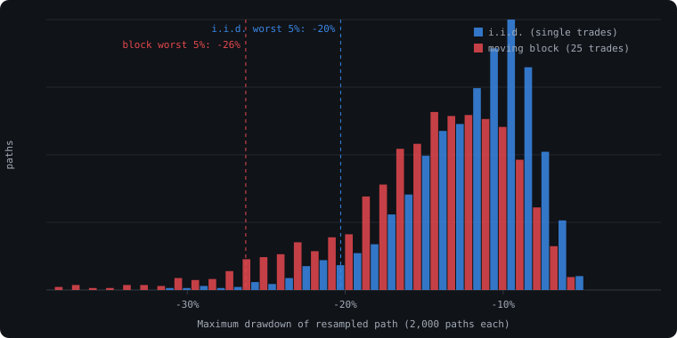

A Monte Carlo section is standard in a backtest report. Take the list of trades, resample
it a thousand times, look at the spread of outcomes. It answers a question the equity
curve alone cannot: *how much of this result is the particular order the trades happened
to arrive in?*

Most implementations answer it wrong, and wrong in the flattering direction. They shuffle
trades one at a time. This post is about why that understates drawdown, what we do
instead, and how to tell which one a report used.

## The problem

Real trade sequences are not independent draws. A trend strategy loses in chop, and chop
lasts weeks. A mean-reversion strategy loses when a range breaks, and the break is
followed by more breaks. Whatever the rule, its losses arrive in runs, because the market
state that causes them persists.

That clustering is *the* thing that produces a deep drawdown. Twenty losing trades spread
evenly through a year cost you twenty small dips. The same twenty trades in a row cost
you a drawdown that gets the strategy switched off.

Resampling single trades destroys the clustering. Each draw is independent of the last, so
the resampled paths have losses scattered uniformly through time. Every path looks
smoother than the real one. The distribution of maximum drawdown shifts toward zero, the
"worst 5% of paths" line moves to a comfortable place, and the report says the strategy
survives scenarios it would not survive.

## What the test does

A moving-block bootstrap resamples *runs* of consecutive trades instead of individual
trades. Pick a random start point, take the next $b$ trades in their original order,
append them, repeat until the path is as long as the original. Within each block the
sequence is preserved, so the clusters survive. Between blocks the order is random, so
you still get a distribution rather than one path.

```python
import numpy as np

def block_bootstrap(trades: np.ndarray, block: int = 25, paths: int = 1000, seed: int = 7):
    """Moving-block bootstrap over a 1-D array of per-trade returns."""
    rng = np.random.default_rng(seed)
    n = len(trades)
    starts = rng.integers(0, n - block, size=(paths, int(np.ceil(n / block))))
    idx = (starts[:, :, None] + np.arange(block)[None, None, :]).reshape(paths, -1)[:, :n]
    return trades[idx]                      # shape: (paths, n)

def max_drawdown(path_returns: np.ndarray) -> np.ndarray:
    """Vectorised max drawdown for each row of a (paths, n) return matrix."""
    equity = np.cumprod(1.0 + path_returns, axis=1)
    peak = np.maximum.accumulate(equity, axis=1)
    return (equity / peak - 1.0).min(axis=1)

paths = block_bootstrap(trade_returns, block=25, paths=1000)
dd = max_drawdown(paths)
print(f"median max DD {np.median(dd):.1%}, worst 5% {np.quantile(dd, 0.05):.1%}")
```

The one parameter that matters is the block length $b$. Too short and you are back to
shuffling single trades. Too long and every path is a rearrangement of a handful of
chunks of the real history, which is barely a distribution. A reasonable default is a
block that spans the typical losing streak with room to spare. For most daily and
intraday rules we start at 25 trades and check the result is not sensitive to moving it
to 15 or 40. If it is sensitive, that itself goes in the report.

There is a formal answer too. For a series with autocorrelation that decays
geometrically, the block length that minimises the bootstrap's mean squared error scales
with the sample size:

$$
b^{*} \propto n^{1/3}
$$

In practice the constant in front depends on the strength of the dependence, which you do
not know precisely, so the rule above is what gets used and the formula is what tells you
the order of magnitude is right.

## What it shows

Below is the same synthetic 600-trade series resampled both ways, 2,000 paths each. The
series was generated with a hidden regime that flips between favourable and unfavourable,
so losses cluster the way they do in a real strategy. Its actual maximum drawdown is
−13.3%.



| Method | Median max drawdown | Worst 5% of paths |
|---|---|---|
| i.i.d. (single trades) | −11.0% | −20.3% |
| Moving block, 25 trades | −14.3% | −26.3% |
| Actual series | −13.3% | — |

Two things to notice. The i.i.d. median is *shallower than the real drawdown*. A method
whose typical scenario is better than what already happened is not stress-testing
anything. And the tail moves by six points. If the sizing rule was "I can tolerate a 20%
drawdown", the i.i.d. version says the strategy fits and the block version says one path
in twenty does not.

On the sample report on our home page the same choice moved the worst-5% line from −22%
to −26% and turned "100% of paths finish above their starting equity" into 99.6%. Neither
number is dramatic on its own. The point is that the honest one is the one you fund
against.

## What it does not tell you

A block bootstrap resamples the trades you have. It cannot invent a regime the strategy
never traded through. If the backtest window has no 2008, no 2020, no rate shock, no path
will contain one. The distribution is a statement about *reordering history*, not about
the future, and it should be read next to the regime analysis rather than instead of it.

It also inherits every flaw in the trade list. Look-ahead in the entry rule, optimistic
fills, missing costs: all of it is resampled faithfully. Monte Carlo is a test of
sequence risk. It is not a test of whether the backtest was honest to begin with.

## How this shows up in a Taurus report

The Monte Carlo block in every report we produce uses a moving-block bootstrap, states
the block length, and shows the sensitivity of the worst-5% drawdown to that length. It
sits between the in-sample versus out-of-sample comparison and the monthly heatmap, and
its numbers are computed from the same trade series as every other figure on the page,
so they cannot disagree with the equity curve above them.

If a report you already have shows a Monte Carlo section, the quickest check is to
compare its median drawdown with the strategy's actual drawdown. If the median is
shallower than what really happened, trades were shuffled one at a time.

## FAQ

### Why not just use a longer backtest instead of a bootstrap?

A longer backtest is better evidence, and you should use all the history you have. But
it still gives you one path. The bootstrap tells you how different that path could have
looked with the same trades in a different order, which is a separate question from how
the strategy did over more time.

### Does block length have to match the strategy's holding period?

No. It has to be longer than the typical losing streak in trades, not in time. A scalping
rule with hundred-trade losing runs needs a longer block than a swing rule with five-trade
runs, even though the scalper's block covers less calendar time.

### What about a stationary bootstrap with random block lengths?

It works too, and it removes the hard edge at block boundaries. The results are close to
the fixed-block version for most trade series we see. We use fixed blocks because the
block length is then a single number a reader can check, and a report is easier to
challenge when its parameters are visible.

### Is resampling daily returns better than resampling trades?

It depends on what the strategy is. For an always-in-market rule, daily returns are the
natural unit. For a rule that is flat most of the time, resampling days mixes flat days
into the blocks and dilutes the clustering. We resample whichever unit the strategy's
losses actually cluster in, and say which in the report.
